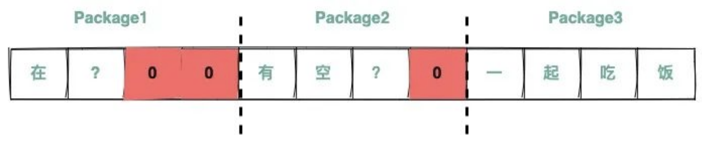
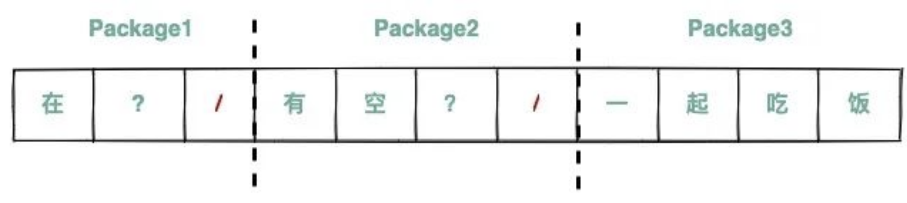
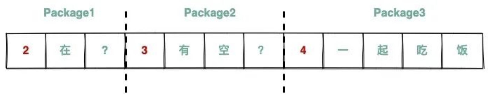

# 一、TCP 的粘包和拆包以及解决方案

TCP 是一个传输协议。TCP 在发送数据的时候，往往不会将数据一次性发送。如下所示：

而是将数据拆分成很多个部分，然后再逐个发送。像下图这样：

 

那么为什么 TCP 协议不一次性发完所有的数据？比如我们要传一个大小为 10M 的文件，对于应用层而言，就是一次传送完成的。而传输层的协议为什么不选择将这个文件一次发送完呢？首先这个有很多原因，比如为了稳定，降低整体任务出错的概率，以及减小底层网络处理的压力，再比如说为了效率，网络中有时候存在着并行的路径，拆分数据包就能更好地利用这些并行的路径。

总之，由于方方面面的原因：在传输层封包的数据块不能太大。这种限制，往往是以缓冲区大小为单位的。也就是 TCP 协议，会将数据拆分成不超过缓冲区大小的一个个部分。每个部分有一个独特的名词，叫作 **TCP 段（TCP Segment）**。

在接收数据的时候，一个个 TCP 段又被重组成原来的数据。

像这样，数据经过拆分，然后传输，然后在目的地重组，俗称 **拆包**。所以拆包是将数据拆分成多个 TCP 段传输。那么粘包是什么呢？有时候，如果发往一个目的地的多个数据太小了，为了防止多次发送占用资源，TCP 协议有可能将它们合并成一个 TCP 段发送，在目的地再还原成多个数据，这个过程俗称 **粘包**。所以粘包是将多个数据合并成一个 TCP 段发送。

 

### 为什么会出现粘包和拆包？

TCP 是一个 `面向流` 的协议，所谓流就是**没有界限的一长串二进制数据**。TCP 作为传输层协议并不了解上层业务数据的具体含义，它会根据 TCP 缓冲区的实际情况进行数据包的划分，所以在业务上认为是一个完整的包，可能会被 TCP 拆分成多个包进行发送，也有可能把多个小的包封装成一个大的数据包发送，这就会出现粘包拆包的问题。

例如，TCP缓冲区是 1024 个字节大小，如果应用一次请求发送的数据量比较小，没达到缓冲区大小，TCP则会将多个请求合并为同一个请求进行发送，站在业务上来看这就是**粘包**;

如果应用一次请求发送的数据量比较大，超过了缓冲区大小，TCP就会将其拆分为多次发送，这就是**拆包**，也就是将一个大的包拆分为多个小包进行发送。

TCP 拆包的作用是将任务拆分处理，降低整体任务出错的概率，以及减小底层网络处理的压力。拆包过程需要保证数据经过网络的传输，又能恢复到原始的顺序。粘包是为了防止数据量过小，导致大量的传输，而将多个 TCP 段合并成一个发送。

 

### 为什么UDP没有粘包？

粘包拆包问题在数据链路层、网络层以及传输层都有可能发生。日常的网络应用开发大都在传输层进行，由于UDP有消息保护边界，接收方一次只接受一条独立的信息，不会发生粘包拆包问题，因此粘包拆包问题只发生在TCP协议中。

举个例子：有三个数据包，大小分别为2k、4k、6k，如果采用UDP发送的话，不管接受方的接收缓存有多大，我们必须要进行至少三次以上的发送才能把数据包发送完，但是使用TCP协议发送的话，我们只需要接受方的接收缓存有12k的大小，就可以一次把这3个数据包全部发送完毕。

 

### 什么时候需要处理粘包现象？

需要处理粘包和拆包问题的场景包括：

- 数据量较大或者频繁发送数据的应用场景，如视频流、音频流等。

- 采用多线程或多进程处理数据的应用场景，如高并发服务器等。

- 传输的数据格式不规则或者长度不定的应用场景，如JSON、XML等格式的数据。

 

### 如何处理粘拆包现象？

2. 定长消息：发送方将每个数据包的长度固定，接收方按照固定长度进行接收和解析。

2. 分隔符消息：发送方在每个数据包之间加入一个特殊的分隔符，接收方按照分隔符进行分包和解析。

3. 消息头+消息体：发送方在每个数据包中加入消息头和消息体，消息头中包含消息体的长度等信息，接收方先接收消息头，再按照消息头中的长度信息接收消息体进行解析。

