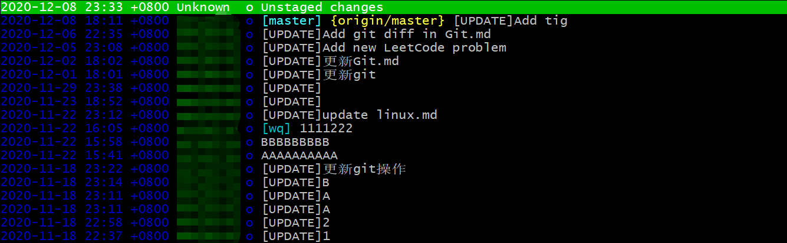
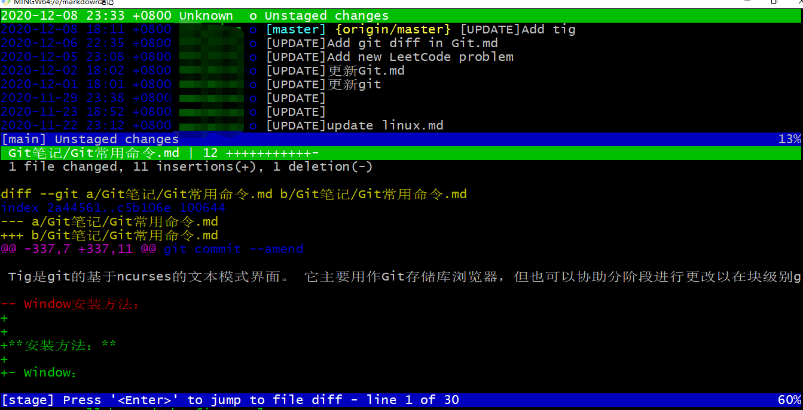
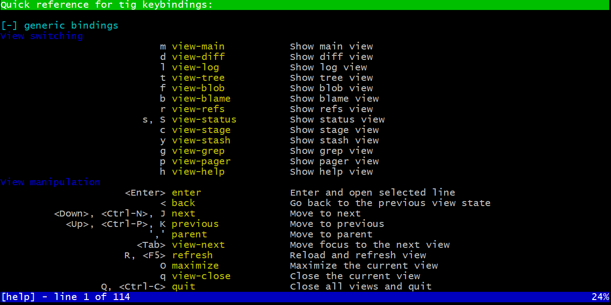

# Tig利器使用

Tig是git的基于ncurses的文本模式界面。 它主要用作Git存储库浏览器，但也可以协助分阶段进行更改以在块级别进行提交，并充当各种Git命令输出的传呼机。这意味着Tig提供了可在终端中运行的基于文本的用户界面。 使用Tig可以轻松浏览Git日志，但是它不仅可以使您从上次提交跳到上一个，还可以做很多事情。


**安装方法：**

- Window：

最简单的方法是安装Windows版Git。 从2.14.2版开始，它与tig捆绑在一起。也就是说，你安装了Git就相当于安装了tig。

- Fedora 和 RHEL： 

  ```shell
  sudo dnf install tig
  ```

- Ubuntu 和 Debian： 

  ```shell
  sudo apt install tig
  ```

- MacOS： 

  ```shell
  brew install tig
  ```

详情，请参阅Github官方[安装说明](https://github.com/jonas/tig/blob/master/INSTALL.adoc)。


**使用方法：**

在 Git 项目中敲 tig, 进入 tig 界面后，可以浏览当前分支的提交历史。




按回车键会展示所选commit提交详情，按`j/k键`或者方向键上下箭头可以从一个commit移动到另一个commit，提交详情会随之修改，提交详情可以按`j/k键`上下移动、`空格/-键`翻页移动， 按q可以退回上一步。




在tig界面按h可以进入help菜单，你可以在其中发现其导航和命令选项。




**浏览单个文件的修改**

由于 Tig 是 `git log` 的封装器，它可以方便地接受可以传递给 `git log` 的相同参数。例如，要浏览单个文件的提交历史记录，请输入：

```text
tig README.md
```

将其与被封装的 Git 命令的输出进行比较，以便更清楚地了解 Tig 如何增强输出。

```text
git log README.md
```

当然，我们可以通过-p选项来查看文件的历史修改log

```text
git log -p README.md
```

也可以加上 |tig选项以获取更好的分页效果以及高亮显示

```shell
git log -p README.md|tig
```


**浏览谁更改了文件**

有时你想知道谁对文件进行了更改以及原因。命令：

```text
tig blame README.md
```

tig本质上是 `git blame` 的封装。我们可以通过该命令查看谁是编辑指定行的最后一人，也可以看到引入该行的提交。


**浏览你的暂存区**

如果你像我一样，你可能会在你的暂存区做了许多修改。你很容易忘记它们。你可以通过以下方式查看暂存处中的最新项目：

```text
git stash show -p stash@{0}
```

你可以通过以下方式找到第二个最新项目：

```text
git stash show -p stash@{1}
```

以此类推。如果你在需要它们时调用这些命令，那么你会有比我更清晰的记忆。

与上面的 Git 命令一样，Tig 可以通过简单的调用轻松增强你的 Git 输出：

```text
tig stash
```

尝试在有暂存的仓库中执行此命令。你将能够浏览并搜索你的暂存项，快速浏览你的那些修改


**结论：**实际上，tig只是作为一个可视化的工具方便我们更好地使用git，tig能实现的，git的也同样能实现，只不过不是那么方便罢了。


参考博客：https://zhuanlan.zhihu.com/p/72554875

https://www.jianshu.com/p/e4ca3030a9d5