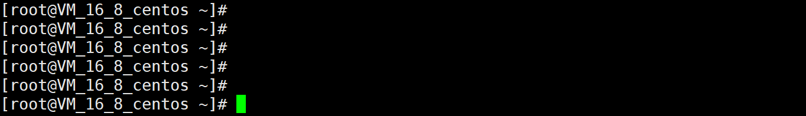

## Shell 教程

### 什么是 Shell？

我们在输入一个指令之后， 底层的硬件会透过我们下达的指令来工作！那么硬件如何知道你下达的指令呢？那就是 `kernel`  (内核) 的控制工作了，真正能够控制计算机硬件（CPU、内存、显示器等）的只有 `kernel` (内核)，而 `shell` 可译为 "外壳"，与 `kernel` 对应，即用户跟内核交互的对话界面。Shell 是指一种应用程序，这个应用程序提供了一个界面，用户通过这个界面访问操作系统内核的服务。

我们常用的 `shell` 有：`Window` 的 `Explorer`（文件资源管理器）等。

我们要知道，`shell` 和 `shell script` 是不一样的东西，`shell` 是程序，是命令解释器，而 `shell script ` 是由 `shell` 所编写的各种小程序即脚本，由于 `shell` 就是一种脚本语言，我们编写完源码后不用编译，直接运行源码即可。业界所说的 `shell` 通常都是指 `shell script`，本教程亦是如此。

<br>

### Shell 的种类

历史上，主要的 Shell 有下面这些。

- Bourne Shell（sh）
- Bourne Again shell（bash）
- C Shell（csh）
- TENEX C Shell（tcsh）
- Korn shell（ksh）
- Z Shell（zsh）
- Friendly Interactive Shell（fish）

<br>

Bash 是目前最常用的 Shell，也就是 Bourne Again Shell，由于易用和免费，Bash 在日常工作中被广泛使用。。除非特别指明，下文的 Shell 和 Bash 当作同义词使用，可以互换。

<br>

使用下面的命令查看自己主机中当前有哪些种类的 Shell

```shell
$ cat /etc/shells 
```

查看 Linux 当前正在使用的 Shell 类型

```shell
$ echo $SHELL 
```

<br>

### 进入 Linux 控制台

一种进入 `Shell` 命令行的方法是让 Linux 系统退出图形界面模式，进入控制台模式，这样一来，显示器上只有一个简单的带着白色文字的“黑屏”，就像图形界面出现之前的样子。这种模式称为 **Linux 控制台（Console）**。

如果是不带有图形环境的 Linux 系统（比如专用于服务器的系统），启动后就直接是命令行环境，进入到了 Linux 的控制台。

不过，现在大部分的 Linux 发行版，尤其是针对普通用户的发行版，都是图形环境，用户登录系统后，自动进入图形环境，需要自己启动终端模拟器，才能进入命令行环境。比如说我自己在 window 上搞个 Oracle VM VirtualBox 装个虚拟机，ubuntu 系统，一打开就是图形环境，需要自己启动终端，才能进入 Linux 的控制台。

<br>

打开命令行，如下图所示，我们就进入到了 Linux 的控制台，可以输入 `shell` 命令



<br>

### Shell 提示符（# 和 $）

启动终端模拟包或者从 Linux 控制台登录后，便可以看到 `Shell` 提示符 `#` 或者 `$`。提示符是是输入 Shell 命令的地方。

对于普通用户，Base shell 默认的提示符是美元符号 `$`；对于超级用户（root 用户），Bash Shell 默认的提示符是井号 `#`。该符号表示 Shell 等待输入命令。

<br>

### Bash 脚本

Bash Shell 脚本是一个纯文本文件，其中包含一组通常在命令行中键入的各种命令，可以作为一个可执行程序。它可用于在 Linux 文件系统上自动执行重复性任务。它可能包含一组命令或一个命令，或者可能包含命令式编程的标志，例如循环，函数，条件构造等。实际上，Bash 脚本是用 Bash 编程语言编写的计算机程序。 

使用下面的命令可以查看 Bash 的版本

```shell
$ bash --version
```

或者

```shell
$ echo $BASH_VERSION
```

<br>

**那如何创建Bash脚本呢？**

1.要创建一个空的 Bash 脚本，首先，使用 `cd` 命令进入保存脚本的目录。使用文本编辑器(如 `vim` )，并键入shell命令。

使用 `vim` 命令创建并编辑脚本文件，`.sh` 后缀是必须提供以执行的扩展名。

```shell
$ vim file_name.sh
```

2.在新打开的文本窗口或文本编辑器中输入 bash 脚本的 shell 命令。

每个基于 Bash 的 Linux 脚本都以以下行开头：

```shell
#!/bin/bash
```

这里 `#!` 是一个约定的标记，这个字符称为 `Shebang`，它告诉系统这个脚本需要什么解释器来执行，即使用哪一种 Shell。

最后，以 `./` 作为前缀来执行当前目录下的 bash 脚本。

```shell
$ ./file_name.sh
```

**注意：**一定要写 `./`，而不是 `file_name.sh`，运行其它二进制的程序也一样，直接写 `file_name.sh`，linux 系统会去 PATH 里寻找有没有叫 `file_name.sh` 的，而只有 `/bin`， `/sbin`， `/usr/bin`，`/usr/sbin` 等目录在 PATH 里，你可以通过 `echo $PATH` 来查看系统变量，你的当前目录通常不在 PATH 里，所以写成 `file_name.sh`  是会找不到命令的，要用 `./file_name.sh` 告诉系统说，就在当前目录找。

<br>

### Shell 变量

#### 变量类型

##### 环境变量

这些变量是由 Linux 操作系统本身创建和维护的预定义变量。它们的标准约定是通常以大写字母进行定义。因此，每当看到以大写字母定义的变量时，很可能它们就是系统定义的环境变量，可以直接使用。

`env` 命令或 `printenv` 命令，可以显示所有环境变量。 

如果要查看单个环境变量

```shell
$ printenv PATH # 注意，printenv命令后面的变量名，不用加前缀$。
# 或者
$ echo $PATH
```

<br>

##### 自定义变量

`set` 命令可以显示所有变量（包括环境变量和自定义变量），以及所有的 Bash 函数。

```shell
$ set
```

如果 `set` 命令显示的变量太多覆盖整个屏幕的话，我们可以用管道 `|` 来划分，例如：

显示前 10 行的变量

```shell
$ set |head -n 10
```

<br>

###### 1. 命名规范

Shell 变量的命名规范和大部分编程语言都一样：

- 变量名由数字、字母、下划线组成。
- 必须以字母或者下划线开头。
- 不能使用 Shell 里的关键字（通过 `help` 命令可以查看保留关键字）。

<br>

定义变量时，变量名不加美元符号（ `$`，PHP语言中变量需要），如：

```shell
$ my_name=TreeStreetCat
$ my_name='TreeStreetCat'
$ my_name="TreeStreetCat"
```

`注意，赋值号的周围不能有空格，这可能和你熟悉的大部分编程语言都不一样。`

`my_name` 是变量名，`TreeStreetCat` 是赋给变量的值。Bash 没有数据类型的概念，所有的变量值都是字符串。如果 `TreeStreetCat` 不包含任何空白符（例如空格、Tab 缩进等），那么可以不使用引号；如果 `TreeStreetCat` 包含了空白符，那么就必须使用引号包围起来。比如：

```shell
$ my_name='Tree Street Cat'
```

<br>

使用单引号和使用双引号也是有区别的。

以单引号 `' '` 包围变量的值时，单引号里面是什么就输出什么，即使内容中有变量和命令（命令需要反引起来）也会把它们原样输出。这种方式比较适合定义显示纯字符串的情况，即不希望解析变量、命令等的场景。

以双引号 `" "` 包围变量的值时，输出时会先解析里面的变量和命令，而不是把双引号中的变量名和命令原样输出。这种方式比较适合字符串中附带有变量和命令并且想将其解析后再输出的变量定义。

```shell
$ my_name='TreeStreetCat'
$ echo 'my name is $my_name'
my name is $my_name
$ echo "my name is $my_name"
my name is TreeStreetCat
```

<br>

```shell
$ my_name='TreeStreetCat1'
$ my_name='TreeStreetCat2'
```

变量可以重复赋值，后面的赋值会覆盖前面的赋值。上面例子中，变量 `my_name` 的第二次赋值会覆盖第一次赋值。

<br>

如果同一行定义多个变量，必须使用分号（ `;` ）分隔。

```shell
$ num1=1;num2=2
```

上面例子中，同一行定义了 num1 和 num2 两个变量。

<br>

###### 2. 使用变量

每当 Shell 看到以 `$` 开头的单词时，就会尝试读取这个变量名对应的值。如果变量不存在，Bash 不会报错，而会输出空字符。所以，我们在使用变量的时候，只要在变量名前面加美元符号 `$` 即可，如：

```shell
$ my_name=TreeStreetCat
$ echo $my_name
$ echo ${my_name}
```

变量名外面的花括号 `{ }` 是可选的，加不加都行，加花括号是为了帮助解释器识别变量的边界，这种写法可以用于变量名与其他字符连用的情况。比如下面这种情况：

```shell
$ skill="Java"
$ echo "I am good at ${skill}Script" 
I am good at JavaScript
```

当然，如果想使用 `$` 符号的原意，必须使用 `\` 转义

```shell
$ echo "\$15.8"
$15.8
```

这里要注意一点，如果我们使用变量赋值给一个变量，例如：

```shell
$ my_name='TreeStreetCat'
$ my_name1=my_name
$ echo my_name1
my_name1
$ echo ${my_name1}
my_name1
$ echo ${!my_name1}
TreeStreetCat
```

上面的例子，变量 `my_name1` 的值是 `my_name`，`${!my_name1}` 的写法将其展开成最终的值。

<br>

###### 3. 删除变量

Shell 为用户提供了删除变量的功能，`unset` 命令可以用来删除一个变量，但是注意，`unset` 命令不能删除只读变量（readonly）

```shell
$ unset NAME
```

实际上，Shell 的变量不存在的话会输出空字符，所以这个命令也可以用空字符赋值，来删除这个变量。

```shell
$ foo=''
$ foo=
```

<br>

##### 特殊变量

前面说到了自定义变量的命名规范，但是 Shell 提供了某些包含其他字符的变量，这些变量有特殊含义，这样的变量被称为**特殊变量**。

<br>

​																		特殊变量列表

| 变量 | 含义                                                         |
| ---- | ------------------------------------------------------------ |
| $0   | 当前脚本的文件名                                             |
| $n   | 传递给脚本或函数的参数。n 是一个数字，表示第几个参数。例如，第一个参数是 $1，第二个参数是 $2。 |
| $#   | 传递给脚本或函数的参数个数。                                 |
| $*   | 传递给脚本或函数的所有参数。                                 |
| $@   | 传递给脚本或函数的所有参数。被双引号( " " )包含时，与 $* 稍有不同，下面将会讲到。 |
| $?   | 上个命令的退出状态，或函数的返回值。                         |
| $$   | 当前 Shell 进程 ID。对于 Shell 脚本，就是这些脚本所在的进程 ID。 |

**示例：**
输出当前 Shell 进程 ID

```shell
$ echo $$
```

<br>

#### declare 命令

**declare** 命令 用于声明和显示已存在的shell变量。当不提供变量名参数时显示所有shell变量。declare命令若不带任何参数选项，则会显示所有shell变量及其值。

##### 语法和选项

**语法：**

```shell
declare [选项] NAME
```

**常见选项：**

| 选项 | 含义                                                         |
| ---- | ------------------------------------------------------------ |
| -a   | 声明数组变量                                                 |
| -f   | 仅显示函数                                                   |
| -F   | 不显示函数定义                                               |
| -i   | 先计算表达式，把结果赋给所声明变量                           |
| -p   | 显示给定变量的定义的方法和值，当使用此选项时，其他的选项将被忽略 |
| -r   | 定义只读变量                                                 |
| -x   | 将指定的Shell变量转换成环境变量                              |

<br>

**示例：**

- 显示已定义的变量：

```shell
$ declare
```

- 定义新的变量：

```shell
$ declare my_name='TreeStreetCat'
```

- 使用 " -i " 定义新的变量：

```shell
$ declare -i num=100+200
```

- 使用 " -p " 显示变量 my_name 和 num 的定义：

```shell
$ declare -p num my_name
```

- 使用 " -r " 可以声明只读变量，但无法改变变量值，也不能 `unset` 变量：

```shell
$ declare -r bar=1
$ bar=2
bash: bar：只读变量
```

<br>

#### readonly 命令

`readonly ` 命令等同于 `declare -r`，用来声明只读变量，不能改变变量值即不能重复赋值，也不能 `unset` 变量。

##### 语法和选项

**语法：**

```shell
readonly [选项] NAME
```

**选项：**

```shell
-f：声明的变量为函数名。
-p：打印出所有的只读变量。
-a：声明的变量为数组。
```

**示例：**

```shell
$ readonly my_name='TreeStreetCat'
```

<br>

#### let 命令

`let` 命令声明变量时，可以直接执行算术表达式。

##### 语法和选项

**语法：**

```shell
let [参数]
```

**示例：**

``` shell
$ let no++ # 自加操作
$ let no-- # 自减操作
```

<br>

### 字符串操作

#### 1. 字符串拼接

字符串拼接比较简单，直接把两个字符串连到一块即可。

```shell
$ first_name='TreeStreet'
$ my_name=${first_name}"Cat"
$ echo $my_name
TreeStreetCat
```

<br>

#### 2. 获取字符串长度

获取字符串长度的语法如下。

```shell
$ ${#string}
```

示例：

```shell
$ my_name=TreeStreetCat
$ echo ${#my_name}
13
```

<br>

#### 3. 提取子字符串

字符串提取子串的语法如下。

```shell
${string:offset:length}
```

上面语法的含义是返回变量 `$string` 的子字符串，从位置 `offset` 开始（从 `0` 开始计算），长度为 `length` ，省略 `length ` 参数则一直到字符串结尾处。如果 `offset` 是负数，则从字符串末尾开始算起。

```shell
$ str="my name is TreeStreetCat"
$ echo ${str:1:4}
y na
$ echo ${str:1}
y name is TreeStreetCat
$ echo ${str: -4:2}
tC
```

注意，这种方式只能通过操作变量来操作字符串，而不能直接对字符串进行提取，直接对字符串进行提取会报错。例如：

```shell
$ echo ${"Helloworld":1}
bash: ${"Helloworld":1}: bad substitution
```

<br>

#### 4. 字符串的替换

字符串替换的语法如下：

```shell
$ ${str/substring/replace}
# 或
$ ${str//substring/replace}
```

用 `replace` 替换字符串中第一个 `substring`，如果需要替换全部则使用 `//`。

```shell
$ str="my name is TreeStreetCat"
$ echo ${str/ee/TT}
my name is TrTTStreetCat
$ echo ${str//ee/TT}
my name is TrTTStrTTtCat
```

<br>

#### 5. 字符串改变大小写

下面的语法可以改变变量的大小写。

```shell
# 转为大写
${str^^}

# 转为小写
${str,,}
```

示例：

```shell
$ echo ${str^^}
MY NAME IS TREESTREETCAT
$ echo ${str,,}
my name is treestreetcat
```

<br>

### 算术运算

#### 1. 算术表达式

Shell 里 `((...))` 双括号语法可以进行整数的算术运算， 使用 `((...))` 会忽略内部的空格，我们在读取`((...))` 的结果需要在前面加上 `$` 符号，下面的写法都是正确的。

```shell
$ echo $(( 11+3))
14
$ echo $(( 11 * 3))
33
$ echo $(( 11   -  3))
8
```

<br>

下表展示了每种算术运算符的语法、描述和示例，都是 `((...))` 语法所支持的， ：

| 运算符 | 描述                                                         |
| ------ | ------------------------------------------------------------ |
| `+`    | 加法，数字(操作数)的加法                                     |
| `-`    | 减法，从第一个到第二个操作数的减法                           |
| `*`    | 乘法，操作数的乘法。                                         |
| `/`    | 除法，第一个操作数除以第二个操作数并返回商。注意，除法返回的是整数而不是带小数点的 |
| `**`   | 求幂，第一操作数的第二操作数的幂值。                         |
| `%`    | 模，测量第一个操作数除以第二个操作数时的余数。               |
| `+=`   | 通过常量递增变量，用于按提供的常量递增第一个操作数的值。     |
| `-=`   | 通过常量递减变量，用于按提供的常量递减第一个操作数的值。     |
| `*=`   | 将变量乘以常数，用于将第一个操作数的值乘以提供的常数。       |
| `/=`   | 将变量除以常数，用于计算(变量/常数)的值并将结果存储回变量。  |
| `%=`   | 变量除以常数的余数，用于计算(变量％常数)的值并将结果存储回变量。 |
| `--`   | 自减运算（前缀或后缀）                                       |
| `++`   | 自增运算（前缀或后缀）                                       |

示例：

```shell
# 加法
$ echo $(( 10 + 3 ))
13
# 减法
$ echo $(( 10 - 3 ))
7
# 乘法
$ echo $(( 10 * 3 ))
30
# 除法
$ echo $(( 10 / 3 ))
3
# 求幂
$ echo $(( 10 ** 3 ))
1000
# 模
$ echo $(( 10 % 3 ))
1
# +=
$ x=10;let "x += 3";echo $x;
13
# -=
$ x=10;let "x -= 3";echo $x;
7
# *=
$ x=10;let "x *= 3";echo $x;
30
# /=
$ x=10;let "x /= 3";echo $x;
3
# %=
$ x=10;let "x %= 3";echo $x;
1
# 自减运算
$ i=0; echo $((i--));
0
# 自增运算
$ i=0; echo $((++i))
1
```


<br>

#### 2. 位运算

`$((...))` 支持以下的二进制位运算符。

| **运算符** | **描述**                                                     |
| ---------- | ------------------------------------------------------------ |
| `<<`       | 位左移运算，把一个数字的所有位向左移动指定的位。             |
| `>>`       | 位右移运算，把一个数字的所有位向右移动指定的位。             |
| `&`        | 位的“与”运算，对两个数字的所有位执行一个`AND`操作。          |
| `|`        | 位的“或”运算，对两个数字的所有位执行一个`OR`操作。           |
| `~`        | 位的“否”运算，对一个数字的所有位取反。                       |
| `^`        | 位的异或运算（exclusive or），对两个数字的所有位执行一个异或操作。 |

示例：

```shell
# 左移
$ echo $(( 4 << 2))
16
# 右移
$ echo $((8 >> 1))
4
# 与运算
$ echo $((16 & 3))
0
# 或运算
$ echo $((16 | 3))
19
# 否运算
$ echo $((~ 3))
-4
# 异或运算
$ echo $((16 ^ 3))
19
```

<br>

#### 3. 逻辑运算 

`$((...))` 支持以下的逻辑运算符。

| **运算符 **         | **描述**                                                     |
| ------------------- | ------------------------------------------------------------ |
| `<`                 | 小于                                                         |
| `>`                 | 大于                                                         |
| `<=`                | 小于或相等                                                   |
| `>=`                | 大于或相等                                                   |
| `==`                | 相等                                                         |
| `!=`                | 不相等                                                       |
| `&&`                | 逻辑与 AND                                                   |
| `||`                | 逻辑或 OR                                                    |
| `!`                 | 逻辑否                                                       |
| `expr1?expr2:expr3` | 三元条件运算符。若表达式`expr1`的计算结果为非零值（算术真），则执行表达式`expr2`，否则执行表达式`expr3`。 |

示例：

```shell
# 小于
$ echo $((3 < 2))
0
# 大于
$ echo $((3 > 2))
1
# 小于或等于
$ echo $((3 <= 2))
0
# 大于或等于
$ echo $((3 <= 2))
0
# 相等
$ echo $((3 == 2))
0
# 不相等
$ echo $((3 != 2))
1
# 逻辑与
$ echo $(( (3 > 2) && (4 <= 1) ))
0
# 逻辑或
$ echo $(( (3 > 2) || (4 <= 1) ))
1
# 逻辑否
$ echo $((!(3 < 2)))
1
# 三元表达式
$ echo $((3 < 2 ? 3 : 2))
2
```

<br>

#### 4. expr

`expr` 是一款表达式计算工具，使用它能完成表达式的求值操作。

```shell
$ a=`expr 5 + 6`
$ echo $a
11
```

这里要注意 `5 + 6` 的运算符 `+` 两边是有空格的，不能省略空格，而 **``** 符号是反引号，是 `Esc` 键下面的那个键。

`expr` 也不支持非整数运算。

```shell
$ expr 2.5 + 7
expr: non-integer argument
```

<br>

### 条件判断

#### 1. if 语句

`if ` 语句是有用且常用的条件语句，`if ` 关键字后面是主要的判断条件，可用于从给定的一组选项中选择一个选项。`condition` 判断为 `true` 则执行 `then` 后面的语句。

```shell
if condition
then
    command1 
    command2
    ...
    commandN 
fi
```

示例：

```shell
if [ $((2 + 3)) > 4 ]; then 
   echo "2加3大于4"; 
fi
```

<br>

#### 2. if else 语句

`if else` 语句简单地说就是在 `if` 语句的基础上加多个 `else`,  `else` 是所有条件都不成立时要执行的部分。

```shell
if condition
then
    command1 
    command2
    ...
    commandN
else
    command
fi
```

注意：这里的 `else` 语句不得为空，如果 `else` 分支没有语句执行，就不要写这个 `else`。

示例：

```shell
if [ $((2 + 3)) > 4 ]; then 
  echo "2加3大于4";
else 
  echo "2加3小于4"; 
fi;
```

<br>

#### 3. else if 语句

和 `if else` 一样，可以使用一组条件运算符连接的一个或多个条件。条件为真时执行命令集。如果没有真实条件，则执行 `else` 语句内的命令块。 

```shell
if condition1
then
    command1
elif condition2
then    
    command2
elif condition3
then 
    command3
...
else
    commandN
fi
```

示例：

```shell
if [ $((2 + 3)) > 4 ]; then 
  echo "2加3大于4";
elif [ $((2 + 3)) < 4 ]; then
  echo "2加3小于4"; 
elif [ $((2 + 3)) == 4 ]; then
  echo "2加3等于4";
fi;
```

<br>

#### 4. test 命令

`test` 命令用于检查某个条件是否成立，它可以进行数值、字符和文件三个方面的测试。一般我们 `if` 的判断条件是用到了 `test` 命令。

`test` 命令有三种写法。

```shell
# 写法一
test expression

# 写法二
[ expression ]

# 写法三
[[ expression ]]
```

注意：使用 `[]` 和 `[[ ]]` 表达式两边**需要留空格。**两个 `[[  ]]` 里面可以使用 `&&`，`||`， 而单个不行。

<br>

- 那我们使用 `test` 命令判断什么呢？。

可以用来判断文件类型，判断文件新旧，判断字符串是否相等，判断权限等等。

<br>

**(一) 判断文件类型**

| 判断参数 | 含义                                         | 说明         |
| -------- | -------------------------------------------- | ------------ |
| -e       | 判断文件是否存在（link文件指向的也必须存在） | exists       |
| -f       | 判断文件是否存在并且是一个普通文件           | file         |
| -d       | 判断文件是否存在并且是一个目录               | directory    |
| -L       | 判断文件是否存在并且是一个软连接文件         | soft link    |
| -b       | 判断文件是否存在并且是一个块设备文件         | block        |
| -S       | 判断文件是否存在并且是一个套接字文件         | socket       |
| -c       | 判断文件是否存在并且是一个字符设备文件       | char         |
| -p       | 判断文件是否存在并且是一个命名管道文件       | pipe         |
| -s       | 判断文件是否存在并且是一个非空文件（有内容） | is not empty |

示例：

```shell
# 只要文件存在条件为真
$ test -e file	
# 判断目录是否存在，存在条件为真
$ [ -d /shell01/dir1 ]		 
# 判断目录是否存在,不存在条件为真
$ [ ! -d /shell01/dir1 ]		
# 判断文件是否存在，并且是一个普通的文件
$ [[ -f /shell01/1.sh ]]		
```

<br>

**(二) 判断文件权限**

| 判断参数 | 含义                                            |
| -------- | ----------------------------------------------- |
| -r       | 当前用户对其是否可读                            |
| -w       | 当前用户对其是否可写                            |
| -x       | 当前用户对其是否可执行                          |
| -u       | 是否有suid，高级权限冒险位                      |
| -g       | 是否sgid，高级权限强制位                        |
| -k       | 是否有t位，高级权限粘滞位 (创建者/root才能删除) |

<br>

**(三) 判断文件新旧**

说明：这里的新旧指的是文件的修改时间。

| 判断参数        | 含义                                                         |
| --------------- | ------------------------------------------------------------ |
| file1 -nt file2 | 比较 `file1` 是否比 `file2` 新                               |
| file1 -ot file2 | 比较 `file1` 是否比 `file2` 旧                               |
| file1 -ef file2 | 比较是否为同一个文件，或者用于判断硬连接，是否指向同一个 `inode` |

<br>

**(四) 判断整数**

| 判断参数   | 含义     |
| ---------- | -------- |
| -eq  ==    | 相等     |
| -ne  <> != | 不等     |
| -gt        | 大于     |
| -lt        | 小于     |
| -ge        | 大于等于 |
| -le        | 小于等于 |

<br>

**(五) 判断字符串**

| 判断参数           | 含义                                        |
| ------------------ | ------------------------------------------- |
| -z                 | 判断是否为空字符串，字符串长度为0则成立     |
| -n                 | 判断是否为非空字符串，字符串长度不为0则成立 |
| string1 = string2  | 判断字符串是否相等                          |
| string1 != string2 | 判断字符串是否相不等                        |

<br>

####  5. && 和 || 操作符

- `&&` 操作符语法如下：

```shell
$ command1 && command2
```

对于 `&& `操作符，先执行 `command1`，只有 `command1` 执行成功后， 才会执行 `command2`。

<br>

- `||` 操作符语法如下：

```shell
$ command1 || command2
```

对于 `||` 操作符，先执行 `command1`，只有 `command1` 执行失败后， 才会执行 `command2`。

示例：

```shell

```

**（待补充）**

<br>

#### 6. case 结构

`shell` 的 `case` 结构为多选择语句

```shell
case expression in  
    pattern_1)  
        command_1  
        command_2
        ...
        ;;  
    pattern_2)  
        command_1  
        command_2
        ...  
        ;;  
    pattern_3|pattern_4|pattern_5)  
        command_1  
        command_2
        ...  
        ;;  
    pattern_n)  
        command_1  
        command_2
        ...
        ;;  
    *)  
        command_1  
        command_2
        ... 
        ;;  
esac
```

`expression` 是一个表达式，`pattern` 是表达式的值或者一个模式，可以有多条，用来匹配多个值，每条以两个分号（ `;` ）结尾。一旦匹配到某个 `pattern` ，则执行完匹配模式对应的命令集后不再执行其他匹配。如果无一匹配模式，使用星号 `*` 匹配该值，再执行后面的命令。

示例：

```shell
#! /bin/bash

echo '输入 1 到 4 之间的数字:'
echo '你输入的数字为:'
read num
case $num in
    1)  echo '你选择了 1'
    ;;
    2)  echo '你选择了 2'
    ;;
    3)  echo '你选择了 3'
    ;;
    4)  echo '你选择了 4'
    ;;
    *)  echo '你没有输入 1 到 4 之间的数字'
    ;;
esac
```


<br>

### 循环

#### 1. for in 循环

`for in` 循环的语法格式如下：

```shell
for variable in item1 item2 ... itemN
do
    command1
    command2
    ...
    commandN
done

# 或者

for variable in list
do
    command1
    command2
    ...
    commandN
done
```

`for` 循环将依次获取列表里项，在循环中使用的变量上分配值。在 `do` 和 `done` 之间执行命令后，循环返回顶部，并从列表中选择下一项，然后重复整个过程。

示例：

```shell
#! /bin/bash

for num in 1 2 3 4 5
do
  echo "当前的数字是："$num;
done

str="This is a string"
for str in $str
do
echo $str
done
```

<br>

#### 2. for 循环

`for` 循环支持C语言的循环语法。第一个表达式指的是初始化过程，第二个表达式指的是终止，第三个表达式指的是增量或减量。`for` 循环语法如下：

```shell
for (( expression1; expression2; expression3 )); 
do
    command1
    command2
    ...
    commandN
done
```

示例：

```shell
#! /bin/bash

for ((i=1; i<=10; i++))  
do  
	echo "$i"  
done
```

<br>

#### 3. while 循环

`while` 循环用于不断地执行一系列命令。只要 `expressions` 判断条件为真即符合条件，`do `和 `done `之间的命令就会重复执行。`while` 循环语法如下：

```shell
while [ expressions ];  
do  
	commands;  
	multiple commands;  
done
```

示例：

```shell
#! /bin/bash

int=1
while(( $int<=5 )) 
do         
  echo $int         
  let "int++" 
done 
```

<br>

#### 4. until 循环

`until` 循环和 `while` 循环恰恰相反，`until` 循环。只要不符合 `expressions` 判断条件（判断条件失败），就不断循环执行指定的语句。一旦符合判断条件，就退出循环。`until` 的语法格式如下：

```shell
until [ expressions ];  
do  
    command1  
    command2  
    . . .  
    . . . .   
    commandN  
done
```

示例：

```shell
#! /bin/bash

int=1
until (( $int>=5 ))
do
  echo $int
  let "int++"
done
```

<br>

#### 5. break、continue 跳出循环

在循环过程中，有时候需要在未达到循环结束条件时强制跳出循环，Shell 使用两个命令来实现该功能：`break` 和 `continue` 。

- **break 命令**

`break` 命令允许跳出所有循环（终止执行后面的所有循环）。

```shell
for number in 1 2 3 4 5
do
  echo "number is $number"
  if [ "$number" = "2" ]; then
    echo "execuse break command"
    break
  fi
done
```

上面例子打印结果如下。一旦变量 `$number` 等于 2，就会跳出循环，不再继续执行。

```shell
number is 1
number is 2
execuse break command
```

<br>

- **continue 命令**

`continue` 命令与 `break` 命令类似，但是有一点差别，它不会跳出所有循环，仅仅跳出当前循环。也就是不会终止后面的所有循环，仅仅终止了本次当前循环。

示例：

```shell
for number in 1 2 3 4 5
do
  echo "number is $number"
  if [ "$number" = "2" ]; then
    echo "execuse continue command"
    continue 
  fi
done
```

<br>

### 数组

#### 1. 定义数组

假如我们想将各个水果名称定义如下：

```shell
$ fruit_name01='apple'
$ fruit_name02='pear'
$ fruit_name03='peach'
$ fruit_name04='grape'
$ fruit_name05='banana' 
```

我们可以使用单个数组来存储所有上述名称，`shell` 数组可以存放多个元素。Shell 数组用括号来表示，元素用 `空格` 符号分割开，以下是创建数组变量的最简单方法。

```shell
$ array_name=(value1 ... valuen)
```

`array_name` 是指声明的数组名，

示例：

```shell
$ fruit_name=('apple' 'pear' 'peach' 'grape' 'banana')
```

我们也可以使用下标来定义数组:

```shell
$ array_name[index1]=value1
$ array_name[index2]=value2
$ array_name[index3]=value3
```

这里 `array_name` 是数组的名称，`index` 是要设置的数组中元素的索引，`value` 是要为该元素设置的值。`Bash shell` 只支持一维数组。

示例：

```shell
$ fruit_name[0]='apple'
$ fruit_name[1]='pear'
$ fruit_name[2]='peach'
$ fruit_name[3]='grape'
$ fruit_name[4]='banana' 
```

当然，我们也可以用 `declare -a` 命令来声明数组

```shell
$ declare -a array_name
```

也可以使用 `read -a` 读取一个数组的输入

```shell
$ read -a array_name
```

<br>

#### 2. 访问数组

- **获取数组中某一元素**

创建完数组之后我们可以使用如下的语法来访问数组。

```shell
${array_name[index]} # index是索引
```

访问数组元素的时候需要加上 `${}` 符号，否则会将 `array_name[index]` 当作字符串原样输出。

```shell
$ array_name[0]='111'
$ echo ${array_name[0]}
111

$ echo array_name[0]
array_name[0]
```

- **获取数组中所有元素**

如果当数组中数量偏少，我们可以一个个获取，如下所示。

```shell
$ fruit_name[0]='apple'
$ fruit_name[1]='pear'
$ fruit_name[2]='peach'
$ fruit_name[3]='grape'
$ fruit_name[4]='banana' 
$ echo "第一个元素为: ${fruit_name[0]}"
$ echo "第二个元素为: ${fruit_name[1]}"
$ echo "第三个元素为: ${fruit_name[2]}"
$ echo "第四个元素为: ${fruit_name[3]}"
$ echo "第四个元素为: ${fruit_name[4]}"
```

但是如果我们想要一次性获取数组中的所有元素呢？

我们可以使用 `@` 或 `*` 来获取数组中的所有元素。

示例：

```shell
$ fruit_name[0]='apple'
$ fruit_name[1]='pear'
$ fruit_name[2]='peach'
$ fruit_name[3]='grape'
$ fruit_name[4]='banana' 
$ echo "数组的元素为: ${fruit_name[*]}"
数组的元素为: apple pear peach grape banana

$ echo "数组的元素为: ${fruit_name[@]}"
数组的元素为: apple pear peach grape banana
```

当然，我们可以用 `@` 或 `*` 配合 循环 来获取数组中的所有元素

```shell
$ fruit_name[0]='apple'
$ fruit_name[1]='pear'
$ fruit_name[2]='peach'
$ fruit_name[3]='grape'
$ fruit_name[4]='banana' 
$ for fruit in "${fruit_name[@]}"; \
do \
echo "fruit: $fruit"; \
done
```

打印结果如下所示：

```shell
fruit: apple
fruit: pear
fruit: peach
fruit: grape
fruit: banana
```

<br>

#### 3. 数组长度

获取数组长度的方法与获取字符串长度的方法相同，可以使用以下的语法：

```shell
${#array[*]}
${#array[@]}
```

示例：

```shell
$ fruit_name[0]='apple'
$ fruit_name[1]='pear'
$ fruit_name[2]='peach'
$ fruit_name[3]='grape'
$ fruit_name[4]='banana'
$ echo "数组元素个数为: ${#fruit_name[*]}"
$ echo "数组元素个数为: ${#fruit_name[@]}"
```

<br>