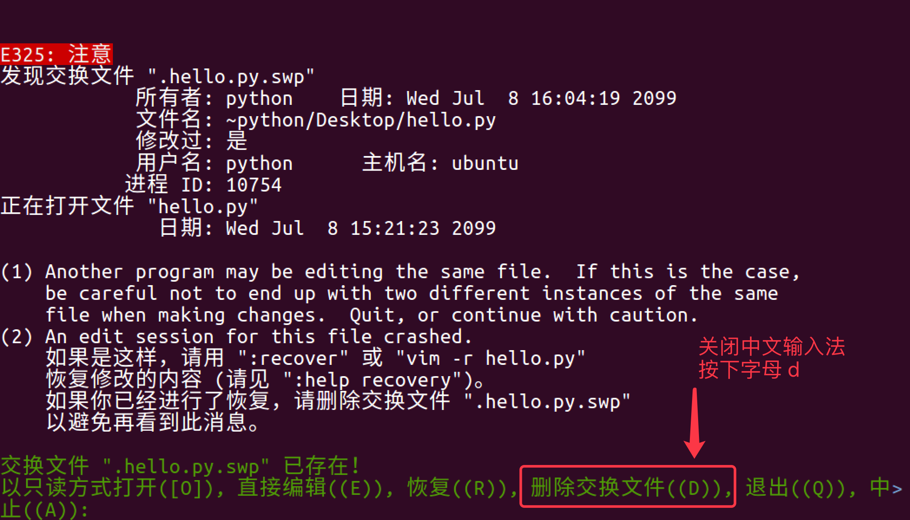

## Vi

### vi 和 vim

- 在很多 `Linux` 发行版中，直接把 `vi` 做成 `vim` 的软连接

#### vi

- `vi` 的特点：
  - **没有图形界面** 的 **功能强大** 的编辑器
  - 只能是编辑 **文本内容**，不能对字体、段落进行排版
  - **不支持鼠标操作**
  - **没有菜单**
  - **只有命令**
- `vi` 编辑器在 **系统管理**、**服务器管理** 编辑文件时，**其功能永远不是图形界面的编辑器能比拟的**

#### `vim`

**vim = vi improved**

- `vim` 是从 `vi` 发展出来的一个文本编辑器，支持 **代码补全**、**编译** 及 **错误跳转** 等方便编程的功能特别丰富，在程序员中被广泛使用，被称为 **编辑器之神**


显示行号：set number

```bash
$ vi 文件名 +行数
```

> 提示：如果只带上 `+` 而不指定行号，会直接定位到文件末尾


**异常处理**

- 如果 `vi` 异常退出，在磁盘上可能会保存有 **交换文件**
- 下次再使用 `vi` 编辑该文件时，会看到以下屏幕信息，按下字母 `d` 可以 **删除交换文件** 即可

> 提示：按下键盘时，注意关闭输入法



> 提示：在 `Touch Bar` 的 Mac 电脑上 ，按 `ESC` 不方便，可以使用 `CTRL + [` 替代


### 末行模式命令

| 命令 |     英文     | 功能                           |
| :--: | :----------: | ------------------------------ |
|  w   |    write     | 保存                           |
|  q   |     quit     | 退出，如果没有保存，不允许退出 |
|  q!  |     quit     | 强行退出，不保存退出           |
|  wq  | write & quit | 保存并退出                     |
|  x   |              | 保存并退出                     |

### 行内移动

| 命令 | 英文 | 功能                           |
| :--: | :--: | ------------------------------ |
|  w   | word | 向后移动一个单词               |
|  b   | back | 向前移动一个单词               |
|  0   |      | 行首                           |
|  ^   |      | 行首，第一个不是空白字符的位置 |
|  $   |      | 行尾                           |

### 行数移动

|  命令  | 英文 | 功能                 |
| :----: | :--: | -------------------- |
|   gg   |  go  | 文件顶部             |
|   G    |  go  | 文件末尾             |
| 数字gg |  go  | 移动到 数字 对应行数 |
| 数字G  |  go  | 移动到 数字 对应行数 |
| :数字  |      | 移动到 数字 对应行数 |

### 屏幕移动

|   命令   |  英文   | 功能     |
| :------: | :-----: | -------- |
| Ctrl + b |  back   | 向上翻页 |
| Ctrl + f | forward | 向下翻页 |
|    H     |  Head   | 屏幕顶部 |
|    M     | Middle  | 屏幕中间 |
|    L     |   Low   | 屏幕底部 |

### 段落移动

- `vi` 中使用 空行 来区分段落
- 在程序开发时，通常 **一段功能相关的代码会写在一起** —— 之间没有空行

| 命令 | 功能   |
| :--: | ------ |
|  {   | 上一段 |
|  }   | 下一段 |

### 括号切换

- 在程序世界中，`()`、`[]`、`{}` 使用频率很高，而且 **都是成对出现的**

| 命令 | 功能           |
| :--: | -------------- |
|  %   | 括号匹配及切换 |

### 标记

- 在开发时，某一块代码可能**需要稍后处理**，例如：编辑、查看
- 此时先使用 `m` 增加一个标记，这样可以 **在需要时快速地跳转回来** 或者 **执行其他编辑操作**
- **标记名称** 可以是 `a~z` 或者 `A~Z` 之间的任意 **一个** 字母
- 添加了标记的 **行如果被删除**，**标记同时被删除**
- 如果 **在其他行添加了相同名称的标记**，**之前添加的标记也会被替换掉**

| 命令 | 英文 | 功能                                             |
| :--: | :--: | ------------------------------------------------ |
|  mx  | mark | 添加标记 x，x 是 a~z 或者 A~Z 之间的任意一个字母 |
|  'x  |      | 直接定位到标记 x 所在位置                        |

选中文本（可视模式）

- 学习 `复制` 命令前，应该先学会 **怎么样选中 要复制的代码**
- 在 `vi` 中要选择文本，需要先使用 `Visual` 命令切换到 **可视模式**
- `vi` 中提供了 **三种** 可视模式，可以方便程序员选择 **选中文本的方式**
- 按 `ESC` 可以放弃选中，返回到 **命令模式**

|   命令   | 模式       | 功能                               |
| :------: | ---------- | ---------------------------------- |
|    v     | 可视模式   | 从光标位置开始按照正常模式选择文本 |
|    V     | 可视行模式 | 选中光标经过的完整行               |
| Ctrl + v | 可视块模式 | 垂直方向选中文本                   |

- **可视模式**下，可以和 **移动命令** 连用，例如：`ggVG` 能够选中所有内容

### 撤销和恢复撤销

- 在学习编辑命令之前，先要知道怎样撤销之前一次 **错误的** 编辑动作！

|   命令   | 英文 | 功能           |
| :------: | :--: | -------------- |
|    u     | undo | 撤销上次命令   |
| CTRL + r | redo | 恢复撤销的命令 |

### 删除文本

|    命令     |  英文  | 功能                              |
| :---------: | :----: | --------------------------------- |
|      x      |  cut   | 删除光标所在字符，或者选中文字    |
| d(移动命令) | delete | 删除移动命令对应的内容            |
|     dd      | delete | 删除光标所在行，可以 ndd 复制多行 |
|      D      | delete | 删除至行尾                        |

> 提示：如果使用 **可视模式** 已经选中了一段文本，那么无论使用 `d` 还是 `x`，都可以删除选中文本

- 删除命令可以和 **移动命令** 连用，以下是常见的组合命令：

```
* dw        # 从光标位置删除到单词末尾
* d0        # 从光标位置删除到一行的起始位置
* d}        # 从光标位置删除到段落结尾
* ndd       # 从光标位置向下连续删除 n 行
* d代码行G   # 从光标所在行 删除到 指定代码行 之间的所有代码
* d'a       # 从光标所在行 删除到 标记a 之间的所有代码
```

### 复制、粘贴

- `vi` 中提供有一个 **被复制文本的缓冲区**
  - **复制** 命令会将选中的文字保存在缓冲区 
  - **删除** 命令删除的文字会被保存在缓冲区
  - 在需要的位置，使用 **粘贴** 命令可以将缓冲区的文字插入到光标所在位置

|    命令     | 英文  | 功能                        |
| :---------: | :---: | --------------------------- |
| y(移动命令) | copy  | 复制                        |
|     yy      | copy  | 复制一行，可以 nyy 复制多行 |
|      p      | paste | 粘贴                        |

**提示**

- 命令 `d`、`x` 类似于图形界面的 **剪切操作** —— `CTRL + X`
- 命令 `y` 类似于图形界面的 **复制操作** —— `CTRL + C`
- 命令 `p` 类似于图形界面的 **粘贴操作** —— `CTRL + V`
- `vi` 中的 **文本缓冲区同样只有一个**，如果后续做过 **复制、剪切** 操作，之前缓冲区中的内容会被替换

**注意**

- `vi` 中的 **文本缓冲区** 和系统的 **剪贴板** 不是同一个
- 所以在其他软件中使用 `CTRL + C` 复制的内容，不能在 `vi` 中通过 `P` 命令粘贴
- 可以在 **编辑模式** 下使用 **鼠标右键粘贴**

### 替换

| 命令 |  英文   | 功能                   | 工作模式 |
| :--: | :-----: | ---------------------- | -------- |
|  r   | replace | 替换当前字符           | 命令模式 |
|  R   | replace | 替换当前行光标后的字符 | 替换模式 |

- `R` 命令可以进入 **替换模式**，替换完成后，按下 `ESC` 可以回到 **命令模式**
- **替换命令** 的作用就是不用进入 **编辑模式**，对文件进行 **轻量级的修改**

### 缩排和重复执行

| 命令 | 功能         |
| :--: | ------------ |
|  >>  | 向右增加缩进 |
|  <<  | 向左减少缩进 |
|  .   | 重复上次命令 |

- **缩排命令** 在开发程序时，**统一增加代码的缩进** 比较有用！
  - 一次性 **在选中代码前增加 4 个空格**，就叫做 **增加缩进**
  - 一次性 **在选中代码前删除 4 个空格**，就叫做 **减少缩进**
- 在 **可视模式** 下，缩排命令只需要使用 **一个** `>` 或者 `<` 

> 在程序中，**缩进** 通常用来表示代码的归属关系
>
> - 前面空格越少，代码的级别越高
> - 前面空格越多，代码的级别越低

### 查找

#### 常规查找

| 命令 | 功能     |
| :--: | -------- |
| /str | 查找 str |

- 查找到指定内容之后，使用 `Next` 查找下一个出现的位置：
  - `n`: 查找下一个
  - `N`: 查找上一个
- 如果不想看到高亮显示，可以随便查找一个文件中不存在的内容即可

#### 单词快速匹配

| 命令 | 功能                     |
| :--: | ------------------------ |
|  *   | 向后查找当前光标所在单词 |
|  #   | 向前查找当前光标所在单词 |

- 在开发中，通过单词快速匹配，可以快速看到这个单词在其他什么位置使用过

### 查找并替换

- 在 `vi` 中查找和替换命令需要在 **末行模式** 下执行
- 记忆命令格式：

```
:%s///g
```

#### 1) 全局替换

- **一次性**替换文件中的 **所有出现的旧文本**
- 命令格式如下：

```
:%s/旧文本/新文本/g
```

#### 2) 可视区域替换

- **先选中** 要替换文字的 **范围**
- 命令格式如下：

```
:s/旧文本/新文本/g
```

#### 3) 确认替换

- 如果把末尾的 `g` 改成 `gc` 在替换的时候，会有提示！**推荐使用！**

```
:%s/旧文本/新文本/gc
```

1. `y` - `yes` 替换
2. `n` - `no` 不替换
3. `a` - `all` 替换所有
4. `q` - `quit` 退出替换
5. `l` - `last` 最后一个，并把光标移动到行首
6. `^E` 向下滚屏
7. `^Y` 向上滚屏

### 插入命令

- 在 `vi` 中除了常用的 `i` 进入 **编辑模式** 外，还提供了以下命令同样可以进入编辑模式：

| 命令 |  英文  | 功能                   |  常用  |
| :--: | :----: | ---------------------- | :----: |
|  i   | insert | 在当前字符前插入文本   |  常用  |
|  I   | insert | 在行首插入文本         | 较常用 |
|  a   | append | 在当前字符后添加文本   |        |
|  A   | append | 在行末添加文本         | 较常用 |
|  o   |        | 在当前行后面插入一空行 |  常用  |
|  O   |        | 在当前行前面插入一空行 |  常用  |


