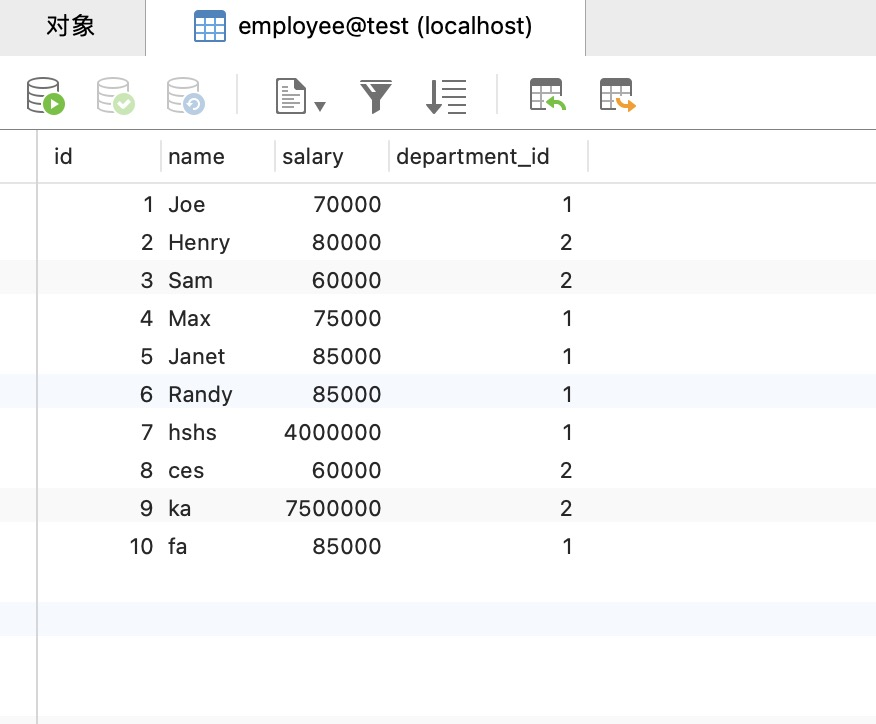

总的来说，SQL语言定义了这么几种操作数据库的能力：

**DDL：Data Definition Language**

DDL允许用户定义数据，也就是创建表、删除表、修改表结构这些操作。通常，DDL由数据库管理员执行。

**DML：Data Manipulation Language**

DML为用户提供添加、删除、更新数据的能力，这些是应用程序对数据库的日常操作。

**DQL：Data Query Language**

DQL允许用户查询数据，这也是通常最频繁的数据库日常操作。

<br>

### 基础

- 创建表

```sql
CREATE TABLE `test` (
  `id` int NOT NULL AUTO_INCREMENT,
  `created_at` datetime DEFAULT NULL,
  `department` varchar(255) DEFAULT NULL,
  `salary` int DEFAULT NULL,
  PRIMARY KEY (`id`)
) ENGINE=InnoDB AUTO_INCREMENT=16 DEFAULT CHARSET=utf8mb4 COLLATE=utf8mb4_0900_ai_ci
```

- 插入语句

```sql
 insert into test (id,created_at,department,salary) values(15,now(),2,2)
```

- 更新语句

```sql
update test set department=3 where id = 15
```

- 删除语句

```sql
delete from test where id = 15;
```


### 1. 查找第N高的数据

有如下数据的员工表。



<br>

**想要找出每个部门薪酬第二高的薪酬怎么找呢？**

首先找出每个部门薪酬最高的薪酬，由于薪酬可能有重复的，所以使用 `distinct`

```sql
select department_id, max(distinct salary) from employee where department_id = 1;
```

再找出小于薪酬最大值的，就是**第二高的薪酬**了

```sql
select e1.department_id, max(distinct salary) from employee e1 where salary < (
     select max(distinct salary) from employee where department_id = e1.department_id) GROUP BY department_id;
```

<br>

**如果想要找出某一部门薪酬第二高的薪酬怎么找呢？**


**找出各部门薪酬前三的员工**

LeetCode：[185. 部门工资前三高的所有员工](https://leetcode-cn.com/problems/department-top-three-salaries/)

解析：部门工资前三的所有员工，这里注意是 每个部门工资前三，不是所有员工工资前三，只需根据子查询查询大于当前员工工资的人数 小于3即可。

这里 `distinct(Salary)`  表示去除重复的薪酬比较，比如 该部门有五人，工资分别是 `7000 8000 8000 9000 6000`，使用 `distinct()` 则会查出 `7000 8000 8000 9000`，不使用 `distinct()` 则会查出 `8000 8000 9000`

```sql
select * from Employee e1 
		where 3 > (select count(DISTINCT e2.Salary) 
                		from Employee e2 where e1.Salary < e2.Salary 
               						and e1.DepartmentId = e2.DepartmentId)
```

<br>

### 2. 删除重复的电子邮箱

LeetCode：[196. 删除重复的电子邮箱](https://leetcode-cn.com/problems/delete-duplicate-emails/)

```sql
delete p1 from Person p1 join Person p2 on p1.Email = p2.Email where p1.Id > p2.Id
```

在 [DELETE 官方文档](https://dev.mysql.com/doc/refman/8.0/en/delete.html)中，给出了这一用法，比如下面这个DELETE语句👇

```sql
delete t1 from t1 left join t2 on t1.id=t2.id where t2.id is NULL;
```

这种 `DELETE` 方式很陌生，竟然和 `SELETE` 的写法类似。它涉及到 `t1` 和 `t2` 两张表，`DELETE t1` 表示要删除 `t1` 的一些记录，具体删哪些，就看 `WHERE` 条件，满足就删；

这里删的是t1表中，跟t2匹配不上的那些记录。

**拓展：**查询重复的记录

```sql
select * from Person group by Email having count(*) > 1 
```

<br>

### 3. 分数排名

LeetCode： [178. 分数排名](https://leetcode-cn.com/problems/rank-scores/)

解析：首先解析 **“排名” ** ，根据分数排名，即当前排名就是当前有多少人分数高于或者低于，假设分数 100 最高，小于 100 的 可以写作 `where score < 100`， 再根据 `count()` 算出排名。

```sql
select a.Score "Score", 
	(select count(distinct b.Score) from Scores b where a.Score <= b.Score ) as "Rank" 
		from Scores a order by a.Score DESC
```

<br>

### 4. 变更性别

LeetCode：[627. 变更性别](https://leetcode-cn.com/problems/swap-salary/)

编写一个 SQL 查询来交换所有的 `'f'` 和 `'m'` （即，将所有 `'f'` 变为 `'m'` ，反之亦然），仅使用 单个 `update` 语句 ，且不产生中间临时表。

```sql
update Salary set sex = case when sex = 'm' then 'f' else 'm' end;
update salary set sex = if(sex = 'm','f','m');
update salary set sex = char(ascii('m') + ascii('f') - ascii(sex));
```

<br>

### 5. 连续出现的数字

LeetCode：[180. 连续出现的数字](https://leetcode-cn.com/problems/consecutive-numbers/)

编写一个 SQL 查询，查找所有至少连续出现三次的数字。

```sql
SELECT DISTINCT
    l1.Num AS ConsecutiveNums
FROM
    Logs l1,
    Logs l2,
    Logs l3
WHERE
    l1.Id = l2.Id - 1
    AND l2.Id = l3.Id - 1
    AND l1.Num = l2.Num
    AND l2.Num = l3.Num
;
```

<br>

### 6. 查找重复的学生

**table name: student**

| id   | name          |
| ---- | ------------- |
| 1    | treestreetcat |
| 2    | treestreetcat |
| 3    | Ming          |
| 4    | Ar            |

- 方法一：

1. 创建一个辅助表，将姓名列进行行分组汇总

```sql
select name, count(*) from student group by name;
```

| name          | count(*) |
| ------------- | -------- |
| treestreetcat | 2        |
| Ming          | 1        |
| Ar            | 1        |

2. 选出辅助表中计数大于1的姓名

```sql
select name from 辅助表 where 计数 > 1;
```

具体的 sql 如下：

```sql
select name from (select name, count(*) as c from student group by name) as temp where temp.c > 1;
```

结果如下：

| name          |
| ------------- |
| treestreetcat |

<br>

- 方法二：

将 `count(*)`  放到条件过滤中

```sql
select name from student group by name having count(*) > 1
```

